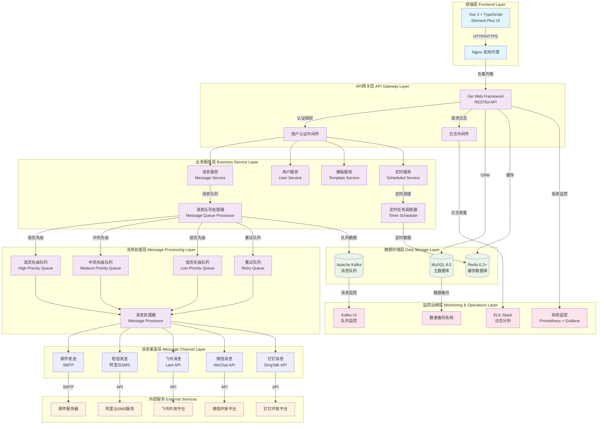
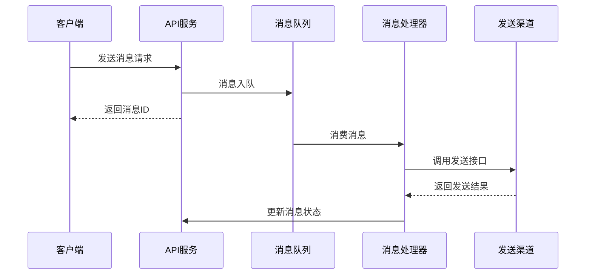
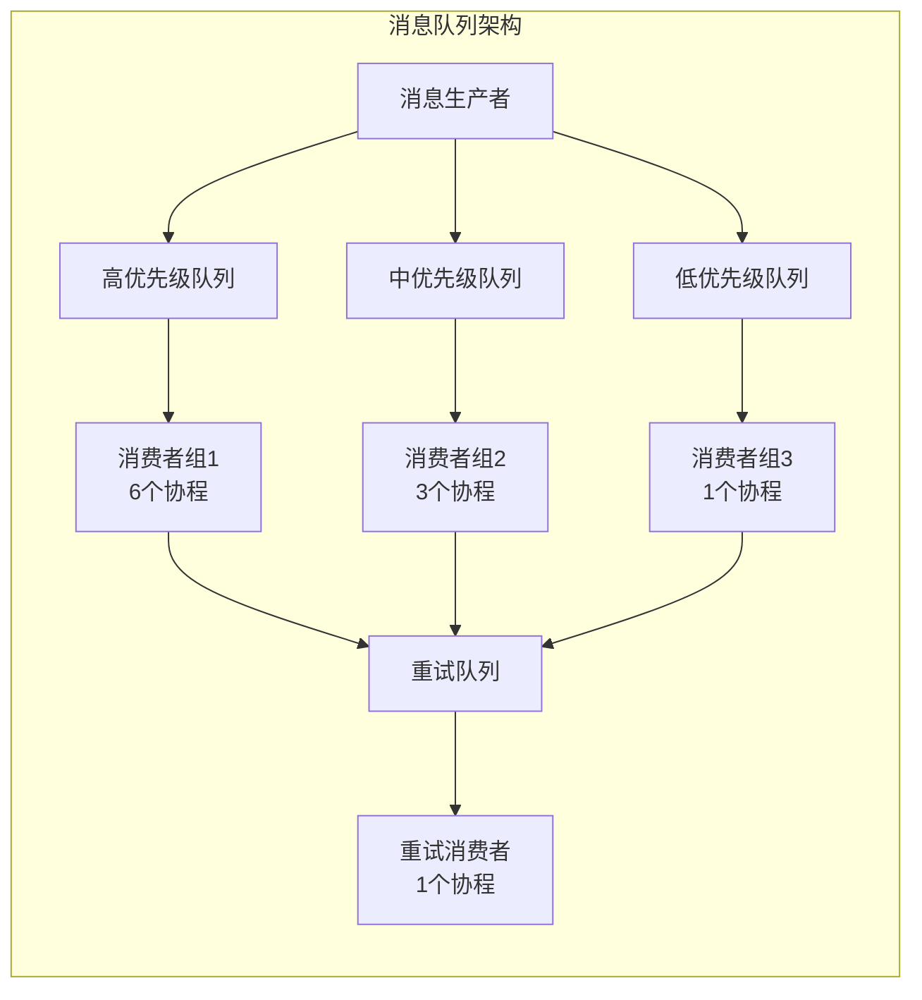
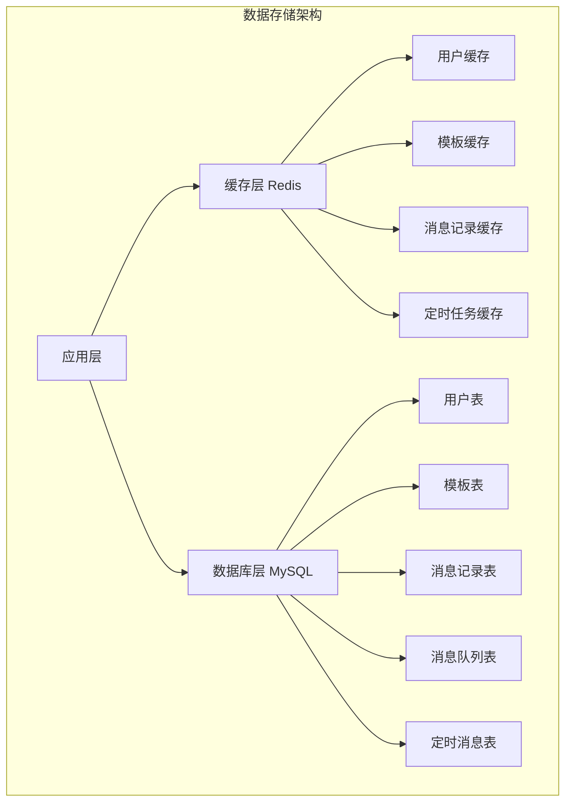
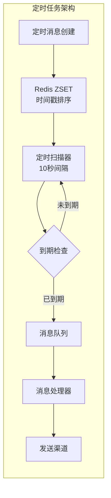

# MsgMate 消息推送系统

<div align="center">


[](https://golang.org/)
[](https://vuejs.org/)
[](LICENSE)

**一个功能完整的企业级消息推送系统，支持多渠道消息发送、用户管理、定时消息和消息记录追踪**

</div>

## 📋 目录

- [项目简介](#-项目简介)
- [核心功能](#-核心功能)
- [技术架构](#-技术架构)
- [项目结构](#-项目结构)
- [快速开始](#-快速开始)
- [配置说明](#-配置说明)
- [API文档](#-api文档)
- [功能演示](#-功能演示)
- [开发指南](#-开发指南)

## 🚀 项目简介

MsgMate 是一个现代化的消息推送系统，旨在为企业提供统一的消息发送解决方案。系统支持多种消息渠道（邮件、短信、飞书），提供完整的用户管理、标签管理、定时消息和消息追踪功能。

### 🎯 设计目标

- **统一消息入口**：提供统一的API接口，支持多渠道消息发送
- **高可用性**：基于消息队列的异步处理，支持重试机制
- **易于扩展**：模块化设计，支持新增消息渠道和功能
- **用户友好**：提供现代化的Web管理界面
- **企业级特性**：支持用户标签、批量发送、定时消息等企业功能

## ✨ 核心功能

### 📧 消息发送
- **多渠道支持**：邮件、短信、飞书消息
- **模板管理**：支持消息模板的创建、编辑和管理
- **批量发送**：支持按用户ID、标签批量发送消息
- **定时发送**：支持定时消息的创建和调度
- **优先级队列**：支持高、中、低、重试四个优先级队列

### 👥 用户管理
- **用户信息管理**：支持用户的增删改查
- **多联系方式**：支持邮箱、手机号、飞书ID等多种联系方式
- **标签系统**：灵活的用户标签管理，支持按标签筛选和批量操作
- **状态管理**：用户启用/禁用状态控制

### 📊 消息追踪
- **发送记录**：完整的消息发送记录和状态追踪
- **重试机制**：自动重试失败消息，支持最大重试次数配置
- **统计分析**：消息发送统计和用户标签统计
- **实时监控**：消息发送状态实时更新

### ⏰ 定时消息
- **灵活调度**：支持任意时间的定时消息发送
- **批量定时**：支持按用户或标签的批量定时消息
- **状态管理**：定时消息的创建、取消和状态追踪

## 🏗️ 技术架构

### 系统架构图



### 架构设计原则

#### 🎯 分层架构 (Layered Architecture)
- **前端层**：负责用户界面展示和交互
- **API网关层**：统一入口，负责路由、认证、限流
- **业务服务层**：核心业务逻辑处理
- **消息处理层**：异步消息处理和队列管理
- **数据存储层**：数据持久化和缓存
- **监控运维层**：系统监控、日志分析、运维管理

#### 🔄 异步处理架构 (Asynchronous Processing)


#### 🏢 微服务架构 (Microservices Architecture)
- **服务拆分**：按业务领域拆分为独立的服务模块
- **服务通信**：通过HTTP API和消息队列进行服务间通信
- **数据隔离**：每个服务管理自己的数据
- **独立部署**：支持服务的独立开发、测试和部署

### 后端技术栈
- **语言**：Go 1.19+
- **框架**：Gin (Web框架)
- **数据库**：MySQL 8.0
- **缓存**：Redis 6.2+
- **消息队列**：Kafka / MySQL (可配置)
- **ORM**：GORM
- **配置管理**：TOML

### 前端技术栈
- **框架**：Vue 3 + TypeScript
- **UI组件**：Element Plus
- **构建工具**：Vite
- **状态管理**：Pinia
- **路由**：Vue Router 4
- **HTTP客户端**：Axios

### 核心组件详解

#### 🚀 消息队列系统


**特性**：
- **优先级队列**：支持高、中、低、重试四个优先级
- **并发处理**：不同优先级使用不同数量的协程处理
- **重试机制**：失败消息自动进入重试队列
- **分布式锁**：支持多实例部署，使用Redis分布式锁

#### 📊 数据存储架构


**特性**：
- **读写分离**：支持MySQL主从架构
- **缓存策略**：热点数据缓存，提高查询性能
- **数据分片**：消息队列表按优先级分表存储
- **事务支持**：关键业务操作使用数据库事务

#### 🔄 定时任务系统


**特性**：
- **精确调度**：基于Redis ZSET实现精确到秒的定时调度
- **高可用**：支持多实例部署，自动故障转移
- **状态管理**：完整的定时消息生命周期管理
- **批量处理**：支持批量定时消息的高效处理

### 架构特点
- **🔧 微服务架构**：模块化设计，易于扩展和维护
- **⚡ 异步处理**：基于消息队列的异步消息处理，提高系统吞吐量
- **🚀 高可用**：支持分布式部署和负载均衡，具备故障自愈能力
- **📈 可扩展**：水平扩展能力，支持业务快速增长
- **🔍 可观测性**：完整的日志记录、监控和链路追踪
- **🛡️ 安全性**：多层安全防护，包括认证、授权、数据加密

## 📁 项目结构

```
msgcenter-main/
├── src/                          # 后端源码
│   ├── config/                   # 配置管理
│   ├── constant/                 # 常量定义
│   ├── ctrl/                     # 控制器层
│   │   ├── consumer/            # 消息消费者
│   │   ├── msg/                 # 消息相关接口
│   │   ├── user/                # 用户管理接口
│   │   ├── scheduled/           # 定时消息接口
│   │   └── msgpush/             # 消息推送实现
│   ├── data/                     # 数据访问层
│   ├── initialize/               # 初始化配置
│   └── main.go                   # 程序入口
├── msgmate-frontend/             # 前端项目
│   ├── src/
│   │   ├── api/                 # API接口
│   │   ├── components/          # 公共组件
│   │   ├── views/               # 页面组件
│   │   │   ├── Dashboard.vue    # 首页仪表板
│   │   │   ├── Messages/        # 消息管理
│   │   │   ├── Users/           # 用户管理
│   │   │   └── Scheduled/       # 定时消息
│   │   ├── router/              # 路由配置
│   │   ├── types/               # TypeScript类型
│   │   └── utils/               # 工具函数
│   ├── package.json
│   └── vite.config.ts
├── config/                       # 配置文件
│   ├── config-docker.toml       # Docker环境配置
│   ├── config-local.toml        # 本地开发配置
│   └── config-test.toml         # 测试环境配置
├── sql/                          # 数据库脚本
├── docker-compose.yml            # Docker编排文件
└── openapi.yml                   # API文档
```

## 🚀 快速开始

### 环境要求

- **Go**: 1.19+
- **Node.js**: 16+
- **Docker**: 20.10+
- **Docker Compose**: 2.0+

### 🎯 一键启动（推荐）

我们提供了一键启动脚本，可以自动启动所有服务：

```bash
# 克隆项目
git clone <repository-url>
cd msgcenter-main

# 一键启动所有服务（使用docker配置）
./start.sh

# 或者指定配置文件
./start.sh -c local    # 使用本地配置
./start.sh -c test     # 使用测试配置
./start.sh -c prod     # 使用生产配置

# 后台运行模式
./start.sh -d

# 仅启动特定服务
./start.sh -m docker    # 仅启动Docker组件
./start.sh -m backend   # 仅启动后端服务
./start.sh -m frontend  # 仅启动前端服务

# 清理并重新启动
./start.sh --clean
```

#### 启动脚本功能

- ✅ **自动检查依赖**：检查Docker、Go、Node.js等环境
- ✅ **端口冲突处理**：自动检测并处理端口占用
- ✅ **服务编排**：按正确顺序启动Docker、后端、前端
- ✅ **健康检查**：等待服务完全启动后再继续
- ✅ **数据库初始化**：自动导入SQL文件
- ✅ **配置选择**：支持多种环境配置
- ✅ **日志管理**：统一的日志输出和文件记录

#### 停止服务

```bash
# 停止所有服务
./stop.sh

# 停止特定服务
./stop.sh -m backend   # 仅停止后端
./stop.sh -m frontend  # 仅停止前端
./stop.sh -m docker    # 仅停止Docker组件

# 完全清理（包括Docker卷和镜像）
./stop.sh --clean
```

#### 查看帮助

```bash
./start.sh --help    # 查看启动脚本帮助
./stop.sh --help     # 查看停止脚本帮助
```

### 📋 手动启动（可选）

如果你需要手动控制启动过程，可以按以下步骤操作：

#### 1. 启动基础服务

```bash
# 启动Docker组件
docker-compose up -d

# 查看服务状态
docker-compose ps
```

#### 2. 初始化数据库

```bash
# 导入数据库结构
docker exec -i msgcenter_mysql mysql -u root -prootpass msgcenter_db < sql/init.sql
docker exec -i msgcenter_mysql mysql -u root -prootpass msgcenter_db < sql/user_management.sql
```

#### 3. 启动后端服务

```bash
# 编译项目
go build -o msgcenter src/main.go

# 启动后端（使用docker配置）
cd src && ../msgcenter docker
```

#### 4. 启动前端服务

```bash
# 安装依赖并启动
cd msgmate-frontend
npm install
npm run dev
```

### 🌐 访问系统

启动完成后，你可以访问以下地址：

- **📱 前端界面**: http://localhost:3000
- **🔧 后端API**: http://localhost:8109
- **🗄️ Kafka UI**: http://localhost:8899
- **🐬 MySQL**: localhost:3306 (用户名: root, 密码: rootpass)
- **🔴 Redis**: localhost:6379 (密码: redispass)

### 📊 服务状态检查

我们提供了一个状态检查脚本，可以快速查看所有服务的运行状态：

```bash
# 一键检查所有服务状态
./status.sh
```

该脚本会检查：
- ✅ **端口状态**：MySQL、Redis、Kafka、后端、前端等服务端口
- ✅ **服务可访问性**：HTTP接口是否正常响应
- ✅ **Docker容器状态**：所有Docker服务的运行状态
- ✅ **进程状态**：后端和前端进程是否正常运行
- ✅ **日志文件**：日志文件大小和位置信息

#### 手动状态检查

```bash
# 检查所有端口状态
lsof -i :3000,3306,6379,8109,9092,8899

# 查看Docker服务状态
docker-compose ps

# 查看服务日志
tail -f log/backend.log    # 后端日志
tail -f log/frontend.log   # 前端日志
docker-compose logs -f     # Docker服务日志
```

## ⚙️ 配置说明

### 配置文件选择

项目提供多个环境的配置文件：

- `config-docker.toml`: **Docker环境配置** (推荐用于快速启动)
- `config-local.toml`: 本地开发配置
- `config-test.toml`: 测试环境配置

### 主要配置项

#### 基础配置
```toml
[COMMON]
port = 8109                     # 服务端口
mysql_as_mq = false            # 是否使用MySQL作为消息队列
consume_priority = 1           # 消费优先级
open_cache = true              # 是否启用Redis缓存
max_retry_count = 4            # 最大重试次数
```

#### 邮件配置
```toml
email_account = "your@email.com"      # 发送邮箱
email_auth_code = "your_auth_code"    # 邮箱授权码
```

#### 短信配置 (阿里云)
```toml
ali_app_id = "your_access_key"        # 阿里云AccessKey
ali_app_secret = "your_secret"        # 阿里云Secret
```

#### 飞书配置
```toml
lark_app_id = "your_lark_app_id"      # 飞书应用ID
lark_app_secret = "your_lark_secret"  # 飞书应用密钥
```

> 📖 **飞书配置指南**：详细的飞书配置步骤请参考 [`config/lark-setup-guide.md`](config/lark-setup-guide.md)

#### 数据库配置
```toml
[MySQL]
url = "localhost:3306"
user = "root"
pwd = "rootpass"
db_name = "msgcenter_db"

[Redis]
url = "localhost:6379"
pwd = "redispass"
db = 0
```

## 📚 API文档

系统提供完整的RESTful API，主要接口包括：

### 消息相关
- `POST /msg/send_msg` - 发送消息
- `GET /msg/get_msg_record` - 获取消息记录
- `GET /msg/list_msg_records` - 消息记录列表

### 模板管理
- `POST /msg/create_template` - 创建模板
- `GET /msg/list_templates` - 模板列表
- `POST /msg/update_template` - 更新模板

### 用户管理
- `POST /user/create` - 创建用户
- `GET /user/list` - 用户列表
- `POST /user/find_by_tags` - 按标签查找用户
- `GET /user/tag_statistics` - 标签统计

### 定时消息
- `POST /scheduled/create` - 创建定时消息
- `GET /scheduled/list` - 定时消息列表
- `POST /scheduled/cancel` - 取消定时消息

详细API文档请参考 `openapi.yml` 文件。

## 🎬 功能演示

### 1. 消息发送
- 支持邮件、短信、飞书多渠道发送
- 模板化消息内容，支持变量替换
- 实时发送状态追踪

### 2. 用户管理
- 用户信息的完整CRUD操作
- 灵活的标签系统，支持多标签管理
- 按标签批量操作用户

### 3. 定时消息
- 可视化的定时消息创建界面
- 支持按用户ID或标签批量定时发送
- 定时消息状态管理和取消功能

### 4. 数据统计
- 消息发送统计图表
- 用户标签分布统计
- 实时的系统运行状态监控

## 🛠️ 开发指南

### 本地开发环境搭建

1. **后端开发**：
   ```bash
   # 使用本地配置
   cd src && go run main.go local
   ```

2. **前端开发**：
   ```bash
   cd msgmate-frontend
   npm run dev
   ```

3. **热重载开发**：
   ```bash
   # 使用watch脚本
   ./watch.sh
   ```

### 添加新的消息渠道

1. 在 `src/ctrl/consumer/new_proc.go` 中实现新的消息处理器
2. 在 `InitMsgProc()` 函数中注册新的处理器
3. 在 `src/data/constant.go` 中添加新的渠道常量

### 数据库迁移

数据库结构变更请在 `sql/` 目录下添加迁移脚本。

### 测试

```bash
# 运行后端测试
go test ./...

# 运行前端测试
cd msgmate-frontend && npm run test
```

## 🤝 贡献指南

1. Fork 项目
2. 创建特性分支 (`git checkout -b feature/AmazingFeature`)
3. 提交更改 (`git commit -m 'Add some AmazingFeature'`)
4. 推送到分支 (`git push origin feature/AmazingFeature`)
5. 打开 Pull Request

## 📄 许可证

本项目采用 MIT 许可证 - 查看 [LICENSE](LICENSE) 文件了解详情。

## 🙏 致谢

感谢所有为这个项目做出贡献的开发者！

---

<div align="center">

**如果这个项目对你有帮助，请给它一个 ⭐️**

</div>
